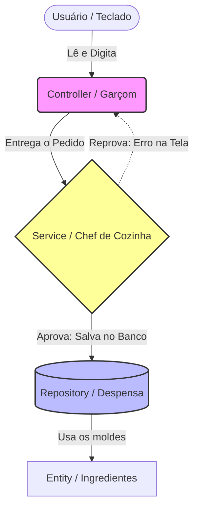
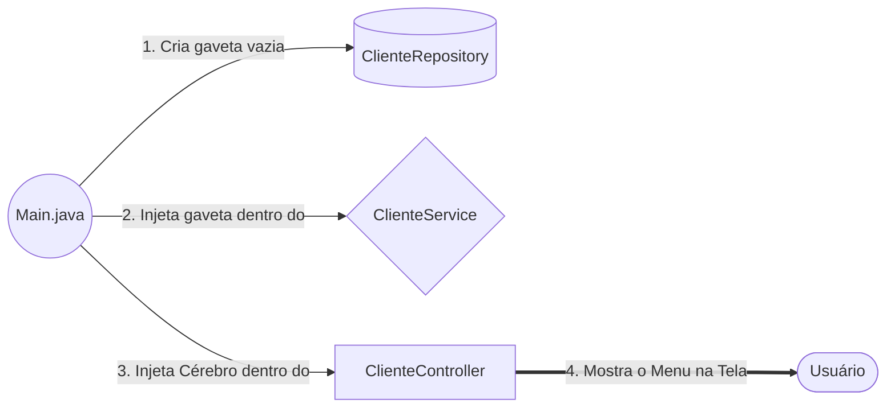

# 📘 Relatório Didático Supremo: Sistema de Oficina Mecânica

Este é o **Guia de Estudos Definitivo** do projeto. Ele foi expandido para cobrir não apenas o "o que foi feito", mas para te ensinar **os conceitos mais avançados da linguagem Java** que foram utilizados debaixo dos panos. 

Se você entender os conceitos deste documento, você estará preparado para construir qualquer sistema corporativo, desde um projeto de faculdade até um back-end real em Spring Boot.

---

## 🏗️ 1. A Arquitetura: Clean Architecture e N-Tier

Quando começamos a programar, a tendência natural é colocar tudo no `Main.java` (o famoso "Código Espaguete"). O problema disso é que o código fica impossível de dar manutenção. Se mudar a regra de um CPF, você corre o risco de quebrar o menu visual.

Para resolver isso, usamos a **Arquitetura em Camadas** (N-Tier Architecture). A regra de ouro é o Princípio da Responsabilidade Única (SOLID): **Cada pasta tem um único motivo para mudar.**

Dividimos o projeto nas 4 camadas clássicas do mercado:
1. **Entity:** O molde dos dados.
2. **Repository:** O banco de dados em memória.
3. **Service:** As regras de negócio e validações lógicas.
4. **Controller:** A interface gráfica ou terminal.

---

## 🍽️ 2. Entendendo as Camadas (A Metáfora do Restaurante)



---

## 🧬 3. Deep Dive: A Camada Entity e a Herança (Orientação a Objetos)

A camada **Entity** contém os "Modelos". São classes burras que só têm variáveis (atributos) e métodos `get/set`. Não processam cálculos.

### O Poder da Herança (`extends`) e das Classes Abstratas (`abstract`)
No projeto, temos 9 entidades diferentes (`Cliente`, `Veiculo`, etc.). Todas elas precisam de um identificador (`ID`) único para o banco de dados. Se fossemos escrever `private Long id;` em todas as 9 classes, estaríamos violando o princípio universal da programação **DRY (Don't Repeat Yourself - Não se repita)**.

**A Solução Magistral:**
Criamos a `EntidadeBase`:
```java
// "abstract" significa que você não pode usar o comando 'new EntidadeBase()'. 
// Ela é apenas um "Fantasma", um molde criado exclusivamente para ser herdado.
public abstract class EntidadeBase {
    
    // 'protected' é crucial aqui. Ele diz: "Apenas minhas classes filhas podem ver esta variável".
    protected Long id; 
    
    public Long getId() { return id; }
    public void setId(Long id) { this.id = id; }
}
```

E as entidades filhas apenas **herdam** isso usando a palavra-chave `extends`:
```java
public class Cliente extends EntidadeBase {
    // A mágica: Eu já possuo o "id" secretamente, não preciso digitar de novo!
    private String nome;
    private String cpf;
}
```

---

## 🗄️ 4. Deep Dive: A Camada Repository e a Mágica dos Genéricos (`<T>`)

O **Repository** é a despensa. A classe mais brilhante e poderosa do projeto é o `RepositoryGenerico`. 

### Por que usar `<T>` (Generics)?
Se não usássemos Genéricos, teríamos que escrever os métodos de salvar e deletar dados 9 vezes diferentes, uma para cada Entidade. O `<T>` é o grande "Coringa" da linguagem Java. Ele diz: *"T pode ser qualquer classe, desde que essa classe herde de EntidadeBase"*.

Quando criamos o repositório filho assim: 
`public class ClienteRepository extends RepositoryGenerico<Cliente> {}`

O compilador do Java secretamente pega a classe mãe e substitui todos os `<T>` que ele encontrar pela palavra `Cliente`. É por isso que você não precisa escrever NENHUMA linha de código nos repositórios do projeto, a mãe já faz todo o trabalho!

### O Segredo de Alta Performance: `LinkedHashMap` vs `ArrayList`
Todo aluno de Java aprende a guardar objetos usando Listas (`ArrayList`). Mas nós revolucionamos escolhendo a Interface `Map` (implementada pelo `LinkedHashMap`). Por quê?

* **O Problema da Lista (Notação Big-O: `O(N)`):** Se a sua oficina faturar muito e tiver 10 milhões de Ordens de Serviço cadastradas em uma Lista, e o usuário mandar buscar a OS de número "9.000.000", o Java vai olhar a OS 1, depois a 2, depois a 3... até encontrar. Isso consome a CPU inteira do computador e congela a tela.
* **A Solução do Map (Notação Big-O: `O(1)`):** O Map funciona exatamente como o índice alfabético de um livro. Ele exige uma **Chave** (O ID numérico) e guarda um **Valor** (O Objeto Cliente inteiro). Quando você pede o ID 9.000.000, o Java pula instantaneamente para a posição exata daquela memória. Não importa se você tem 10 ou 10 milhões de clientes, a busca leva o mesmo tempo: 1 milissegundo.

```java
public abstract class RepositoryGenerico<T extends EntidadeBase> {
    // Chave = Long (O ID). Valor = T (A Entidade inteira, ex: Cliente)
    protected Map<Long, T> dados = new LinkedHashMap<>();
    protected long proximoId = 1; // Contador universal automático

    public T salvar(T entidade) {
        if (entidade.getId() == null) {
            entidade.setId(proximoId++); // O ++ incrementa o ID automaticamente (1, 2, 3...)
        }
        dados.put(entidade.getId(), entidade); // O comando '.put()' guarda o dado instantaneamente
        return entidade;
    }
}
```

---

## 🧠 5. Deep Dive: A Camada Service e o Controle de Exceções

O **Service** é onde moram as **Regras de Negócio** da empresa. 

### O "Freio de Emergência" (Tratamento de Erros por Lançamento)
A regra fundamental de segurança da informação é: **Dados corrompidos ou inválidos nunca devem sequer tocar na camada do banco de dados.**

Como garantimos essa barreira? Usando o comando `throw new ...`.
```java
public class ClienteService {
    private final ClienteRepository repositorio;
    
    public Cliente salvar(Cliente cliente) {
        if (cliente.getNome() == null || cliente.getNome().isBlank()) {
            // Se cair neste IF, o Java CANCELA a execução do método IMEDIATAMENTE.
            // A linha de baixo "repositorio.salvar()" nunca será atingida. O dado é bloqueado!
            throw new RegraNegocioException("Erro: Nome obrigatório!");
        }
        return repositorio.salvar(cliente);
    }
}
```

### Checked vs Unchecked (Por que criamos a nossa própria Exception?)
Nós criamos a classe especial `RegraNegocioException extends RuntimeException`. No Java, existem dois grandes mundos de Exceptions:
1. **Checked (`Exception`):** Obriga o programador a escrever `throws Exception` na assinatura de absolutamente todos os métodos que chamam aquela regra. Deixa o código visualmente horrível e engessado.
2. **Unchecked (`RuntimeException`):** Foi a nossa escolha de ouro. O erro é "jogado" silenciosamente para o alto através das camadas. O Java se encarrega de transportá-lo do Service para o Controller sem sujar o código do meio do caminho. 

---

## 🖥️ 6. Deep Dive: A Camada Controller e o Escudo `ConsoleUtils`

O **Controller** traduz a máquina para o humano, exibindo os menus visuais.

### Como o `ConsoleUtils` salva a vida do programa em memória
Quando o Java pede um Número (`scanner.nextInt()`) e o usuário digita a letra `"A"`, o Java cospe um erro catastrófico de conversão (`InputMismatchException` ou `NumberFormatException`) e "Mata" o terminal do Windows na hora. 

Como o nosso projeto não salva em HD (ele salva em `Map` na memória RAM), se o terminal morrer, **nós perdemos 100% de todos os clientes e veículos já cadastrados**. O usuário teria que reabrir o programa e recadastrar do zero.

A vacina para isso é o bloco `try-catch` encapsulado em um laço infinito `while(true)`.
* **O `try`:** Tenta executar a conversão. Se for sucesso, ele aciona o `return` (o return tem o poder de aniquilar laços infinitos e devolver a resposta na hora).
* **O `catch`:** Se der erro, ele segura a "explosão" com as mãos. Como ele engoliu o erro e não ativou o `return`, o `while` simplesmente roda o carrossel de novo, pedindo para o usuário digitar a resposta novamente. E o programa sobrevive intacto!

```java
public class ConsoleUtils {
    private final Scanner scanner;

    public int lerInt() {
        while (true) { // O laço da persistência
            try {
                // Sempre lemos tudo como TEXTO (nextLine) primeiro.
                // Depois convertemos para Número (parseInt).
                // ISSO CORRIGE O BUG NATIVO DO JAVA DO SCANNER PULANDO LINHAS!
                return Integer.parseInt(scanner.nextLine());
                
            } catch (NumberFormatException e) {
                System.out.println("⚠️ Digite um número inteiro válido."); // O programa vive!
            }
        }
    }
}
```

---

## 🔌 7. A Cola Universal: Injeção de Dependência no `Main.java`

O `Main.java` orquestra tudo através de um padrão de projeto chamado **Injeção de Dependência**.

### Por que as variáveis são `private final` nos Services e Controllers?
Repare no `ClienteService`: a variável do repositório é declarada como `private final ClienteRepository repositorio;`. 
* `private` garante o isolamento.
* `final` significa "imutável / cravado em pedra". Depois que o Service receber o Repositório no nascimento, ele **nunca mais** pode ser trocado por outro acidentalmente, e o Java proíbe que ele seja nulo depois disso.

Para viabilizar o `final`, nós obrigamos que a gaveta seja passada através do **Construtor**. 



Se nós tivéssemos sido preguiçosos e mandado a classe `ClienteService` dar um `new ClienteRepository()` lá dentro por conta própria, cada Service do projeto teria construído sua própria gaveta particular. Um carro salvo não acharia o seu cliente, pois eles estariam em universos (memórias) paralelos.

Fazendo a Injeção pelo Main, garantimos a **Sincronicidade**:
```java
// O Main é o Deus Supremo do ecossistema. 

// 1. Criamos a gaveta (Só existirá UMA na memória RAM)
ClienteRepository repo = new ClienteRepository();

// 2. Empurramos (Injetamos) a gaveta dentro do Service
ClienteService service = new ClienteService(repo);

// 3. Empurramos o Service dentro do Controller 
ConsoleUtils console = new ConsoleUtils();
ClienteController controller = new ClienteController(service, console);

// 4. Damos Play no jogo
controller.exibirMenu();
```

---

## 🚀 8. Resumo Final: A Receita de Bolo para Novos Módulos

Se o professor pedir para você criar uma nova área no sistema chamada "Orçamento" amanhã, você não precisa pensar. Apenas siga a receita, sempre de "Dentro" para "Fora":

1. **Camada Entity (`Orcamento.java`):** 
   Crie a classe com `extends EntidadeBase`. Adicione as propriedades (`valor`, `data`) e gere os Getters/Setters.
2. **Camada Repository (`OrcamentoRepository.java`):** 
   `public class OrcamentoRepository extends RepositoryGenerico<Orcamento> {}` *(Basta isso, e você acaba de ganhar um Banco de Dados ultrarrápido).*
3. **Camada Service (`OrcamentoService.java`):** 
   Crie a classe, exija o `OrcamentoRepository` dentro do construtor dela. Programe o método `salvar()` com os seus `ifs` de validação usando o `throw new RegraNegocioException()`.
4. **Camada Controller (`OrcamentoController.java`):** 
   Faça o design do Menu visual. Use o nosso `console.lerInt()` seguro para ler as escolhas. Encaminhe o objeto limpo para o Service.
5. **A cola no `Main.java`:** 
   Instancie o repo. Instancie o service. Instancie o controller. Adicione a nova opção na fachada visual do Menu Principal.

**Fim de Papo.** Se você dominou isso, você domina a base do que engenheiros de Software Sêniores fazem no dia a dia com frameworks complexos!
